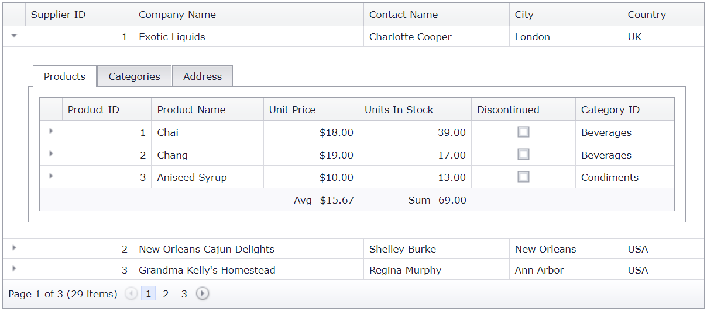

<!-- default badges list -->

[](https://supportcenter.devexpress.com/ticket/details/T203289)
[](https://docs.devexpress.com/GeneralInformation/403183)
[](#does-this-example-address-your-development-requirementsobjectives)
<!-- default badges end -->
# Grid View for ASP.NET MVC - Advanced master-detail view

This example demonstrates how to use a page control in a detail row template to switch between detail grids.



## Overview

Define a master grid and set its [SettingsDetail.ShowDetailRow](https://docs.devexpress.com/AspNet/DevExpress.Web.ASPxGridViewDetailSettings.ShowDetailRow) property to `true`.

```cshtml
settings.SettingsDetail.ShowDetailRow = true;
```

Call the grid's [SetDetailRowTemplateContent](https://docs.devexpress.com/AspNetMvc/DevExpress.Web.Mvc.GridViewSettings.SetDetailRowTemplateContent.overloads) method and add a page control to the template.

```cshtml
settings.SetDetailRowTemplateContent(container => {
    var keyValue = container.KeyValue;
    ViewContext.Writer.Write("<div style='padding: 3px 3px 2px 3px'>");
    Html.RenderAction("PageControlPartial", new { key = keyValue });
    ViewContext.Writer.Write("</div>");
});
```

For every tab page in the page control, call its `SetContent` method to display the corresponding detail grid.

```cshtml
@Html.DevExpress().PageControl(settings => {
    settings.Name = "PageControl" + ViewData["key"];
    settings.Width = Unit.Percentage(100);
    settings.CallbackRouteValues = new { Controller = "Home", Action = "PageControlPartial", key = ViewData["key"] };
    settings.TabPages.Add("Products").SetContent(() => {
        Html.RenderAction("ProductsGridViewPartial", new { key = Model.SupplierID });
    });
    settings.TabPages.Add("Categories").SetContent(() => {
        Html.RenderAction("CategoryGridViewPartial", new { key = Model.SupplierID });
    });
    settings.TabPages.Add("Address").SetContent(() => {
        Html.RenderPartial("DetailInformation");
    });
}).GetHtml()
```

## Files to Review

* [HomeController.cs](./CS/AdvancedMasterDetail/Controllers/HomeController.cs) (VB: [HomeController.vb](./VB/AdvancedMasterDetail/Controllers/HomeController.vb))
* [_MasterGridViewPartial.cshtml](./CS/AdvancedMasterDetail/Views/Home/_MasterGridViewPartial.cshtml)
* [DetailPageControl.cshtml](./CS/AdvancedMasterDetail/Views/Home/DetailPageControl.cshtml)

## Documentation

* [Grid Templates](https://docs.devexpress.com/AspNetMvc/14721/common-features/templates)
* [Master-Detail Relationship](https://docs.devexpress.com/AspNet/3772/components/grid-view/concepts/master-detail-relationship)
* [Callback-Based Functionality](https://docs.devexpress.com/AspNetMvc/9052/common-features/callback-based-functionality)

## More Examples

* [Grid View for ASP.NET Web Forms - Advanced master-detail view](https://demos.devexpress.com/ASPxGridViewDemos/MasterDetail/DetailTabs.aspx)
* [Grid View for MVC - How to implement the master-detail GridView with editing capabilities](https://github.com/DevExpress-Examples/asp-net-mvc-gridview-master-detail-with-editing)
<!-- feedback -->
## Does this example address your development requirements/objectives?

[](https://www.devexpress.com/support/examples/survey.xml?utm_source=github&utm_campaign=asp-net-mvc-grid-advanced-master-detail-view&~~~was_helpful=yes) [](https://www.devexpress.com/support/examples/survey.xml?utm_source=github&utm_campaign=asp-net-mvc-grid-advanced-master-detail-view&~~~was_helpful=no)

(you will be redirected to DevExpress.com to submit your response)
<!-- feedback end -->
